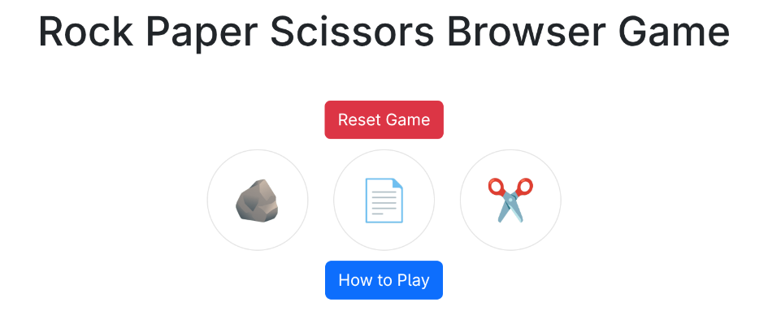

# ✊✋✌️ Rock Paper Scissors Browser Game

## 🕹️ Description

- This is a simple Rock, Paper, Scissors game made with HTML, CSS, and JavaScript.
- The player chooses rock, paper, or scissors.
- The computer makes a random choice.
- The winner is displayed in a message.

## 🚀 Getting Started

👉 **Play it here:** [https://smhatc.github.io/js-rock-paper-scissors](https://smhatc.github.io/js-rock-paper-scissors)

### How to Play
1. Open the link to the game.
2. Click Rock, Paper, or Scissors.
3. The computer will choose too.
4. The winner is shown.

## 💡 Technologies Used

- HTML.
- CSS.
- JavaScript.

## 🚧 Next Steps

- Add sound effects.
- Add animations.
- Make it work on phones.